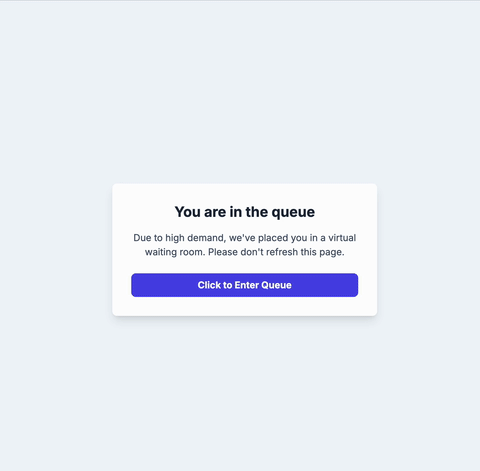

# 🚀 AWS Waiting Room 🚀

This project implements a scalable, serverless virtual waiting room system on AWS, similar to those used for high-demand ticket sales or product launches. It is designed to protect a main website from traffic spikes by placing users in a fair, first-in-first-out (FIFO) queue.

The entire infrastructure is defined using Terraform and deployed automatically via a secure GitHub Actions CI/CD pipeline.

## 🎥 Demo

<p align="center">
  
</p>

## ✨ Key Features

-   **🛡️ Edge-Level Protection:** Uses Lambda@Edge to intercept traffic at the CDN level, redirecting users *before* they can hit the main application.
-   **🥇 First-In, First-Out Queuing:** A true FIFO SQS queue guarantees that users are processed in the exact order they arrived.
-   **🎟️ Secure JWT Pass System:** Users who are allowed through the queue receive a short-lived JSON Web Token (JWT) as a secure "pass" to prevent them from being sent back to the queue.
-   **✅ Real-Time Position Updates:** Users can see their real-time position in the queue, which updates automatically and will only ever decrease.
-   **🎛️ Dynamic On/Off Control:** The entire waiting room can be enabled or disabled instantly via a feature flag in AWS SSM Parameter Store without redeploying any code.
-   **🏗️ Infrastructure as Code (IaC):** The entire infrastructure is managed by Terraform for repeatable, version-controlled deployments.
-   **🤖 Automated & Secure CI/CD:** A GitHub Actions workflow using secure OIDC (no long-lived access keys) automatically builds Lambda dependencies and deploys changes to AWS on every push to the `main` branch.
-   **☁️ Fully Serverless:** Built on managed AWS services for ultimate scalability and low operational overhead.

## 🏗️ Architecture Diagram

The system is composed of two main sites: the **Main Website** (which is protected) and the **Waiting Room Website**.

## 🛠️ Technology Stack

-   **AWS Services:**
    -   API Gateway (HTTP API)
    -   AWS Lambda & Lambda@Edge
    -   Amazon SQS (FIFO Queue)
    -   Amazon DynamoDB
    -   Amazon S3
    -   Amazon CloudFront
    -   AWS IAM (OIDC for GitHub Actions)
    -   AWS Systems Manager (SSM) Parameter Store
-   **Infrastructure & Deployment:**
    -   Terraform
    -   GitHub Actions
-   **Libraries:**
    -   PyJWT (for signing and validating "pass" tokens)

## 🚀 Setup and Deployment

### 1. Prerequisites

-   An AWS account.
-   Terraform CLI installed locally.
-   A GitHub account and a new repository for this project.
-   AWS credentials configured locally with permissions to create the initial IAM OIDC role.

### 2. Clone the Repository

```bash
git clone https://github.com/antoinedelia/waiting-room
cd waiting-room
```

### 3. Bootstrap the Terraform Backend

The project uses a remote S3 backend for Terraform state. It must be created beforehand.

### 4. Set GitHub Secrets

1.  In your GitHub repository, go to `Settings > Secrets and variables > Actions`.
2.  Create the following repository secrets:
    1.  `AWS_IAM_ROLE_ARN`: use the IAM Role ARN that has access to your GitHub repository.
    2.  `TF_BUCKET`: use the S3 Bucket Name as your backend.
    3.  `TF_STATE_KEY`: use the state key you wish to

### 6. Final Configuration

The Lambda@Edge function needs to know the URLs of the other sites. After your first successful deployment:

1.  Copy the `waiting_room_url` and `main_website_url` from the Terraform outputs in the GitHub Actions log.
2.  Paste these URLs into the placeholder variables in `frontend_waiting_room/index.html`.
3.  Commit and push this final change.

## ⚙️ How to Use

### Toggling the Waiting Room

-   **To turn ON:** Navigate to AWS Systems Manager -> Parameter Store. Find `/waiting-room/config/enabled` and set its value to `true`.
-   **To turn OFF:** Change the value to `false`. The change takes effect almost instantly.

### Testing the User Flow

1.  Ensure the waiting room is turned **ON**.
2.  Navigate to the **`main_website_url`**.
3.  You should be immediately redirected to the **`waiting_room_url`**.
4.  Click "Click to Enter Queue". Your real position will be displayed.
5.  Once allowed, you will be redirected back to the main website with your JWT pass and will be able to browse freely.

### Simulating High Traffic 🚦

A Python script `simulate_users.py` is provided to test the queueing mechanism.

1.  Install requests: `pip install requests`
2.  Update the `API_ENDPOINT` in the script with your `/join` endpoint URL.
3.  Run the script: `python simulate_users.py`
